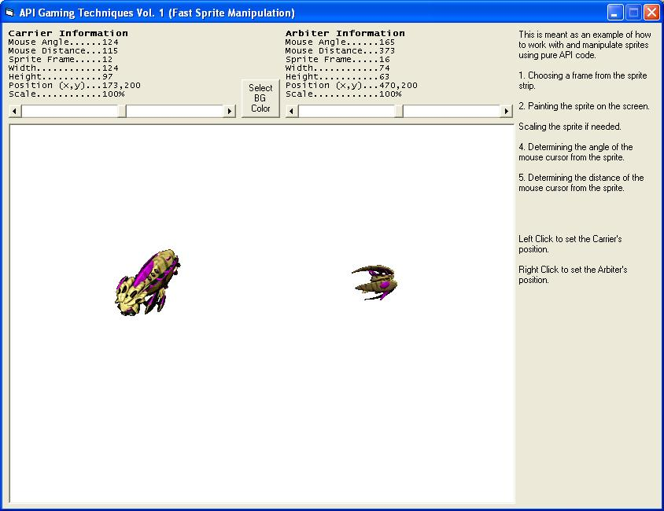



## API Gaming Techniques Vol\. 1 \- Fast Sprite Manipulation

### Description

I will be creating a series of API Gaming tutorials to help newer game programmers to get started, so I searched around existing tutorials to try to make something new.

Direct X is by far the best way to go in creating games in VB but API is very effective, and easier to learn. So hopefully this will be helpful and informative to some people.

In this example I've placed a couple Starcraft ship sprites into it. These sprites will track your mouse and face the direction of your mouse. This is useful in that it teaches multiple techniques at once. This includes transparent painting, loading bitmaps into memory for fast painting, painting from a sprite strip, determining distance between 2 points, determining the angle between points (something I wasn't able to find here at planet source code, and a lot of useful math functions.

I spend most of my time programming for commercial applications but I will try to check this as often as I can. So if anyone needs help or explanations post a comment and I'll try to respond as quick as I can. Also I've commented nearly every line of this project so hopefully most things should be very understandable.
 
### More Info
 

             |
---                |---
**Submitted On**   |2009-09-06 22:16:42
**By**             |[KRYO\_11](https://github.com/Planet-Source-Code/PSCIndex/blob/master/ByAuthor/kryo-11.md)
**Level**          |Intermediate
**User Rating**    |5.0 (15 globes from 3 users)
**Compatibility**  |VB 6\.0
**Category**       |[Games](https://github.com/Planet-Source-Code/PSCIndex/blob/master/ByCategory/games__1-38.md)
**World**          |[Visual Basic](https://github.com/Planet-Source-Code/PSCIndex/blob/master/ByWorld/visual-basic.md)
**Archive File**   |[API\_Gaming216202972009\.zip](https://github.com/Planet-Source-Code/kryo-11-api-gaming-techniques-vol-1-fast-sprite-manipulation__1-72436/archive/master.zip)

